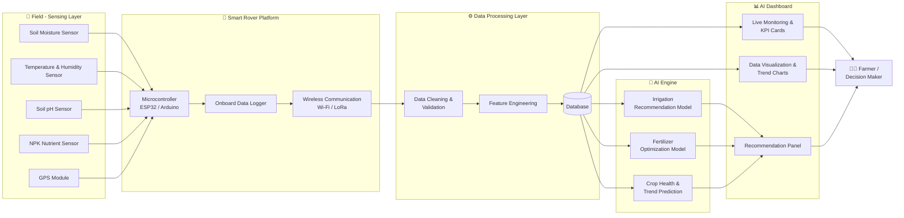

<div align="center">

# 🌾 Smart Rover AI Dashboard for Precision Agriculture

### AI-Powered Agricultural Monitoring & Decision-Support System

[](https://www.python.org/)
[](https://www.apache.org/licenses/LICENSE-2.0)
[]()
[]()
[]()
[]()
[]()

<p>An autonomous rover collects real-time field data, while an AI-powered dashboard transforms that data into actionable irrigation and fertilizer recommendations for farmers.</p>

</div>

---

## 📌 Overview

The **Smart Rover AI Dashboard** is an end-to-end precision agriculture system that bridges the gap between **field-level data collection** and **intelligent decision-making**. A sensor-equipped rover roams the field, continuously capturing environmental and soil parameters such as moisture, temperature, humidity, pH, and nutrient (NPK) levels. This data is transmitted to a centralized AI dashboard, which performs **data visualization, predictive analytics, and recommendation generation**.

The core objective of this project is to **reduce resource wastage, improve crop yield, and empower farmers with data-driven insights** — without requiring deep technical expertise. The rover acts purely as a **mobile data collection platform**, while the dashboard handles all heavy-lifting: analytics, machine learning inference, and visualization.

This project is designed to be **modular, scalable, and research-friendly**, making it suitable for academic demonstrations, hackathons, and as a foundation for real-world deployment.

---

## ❗ Problem Statement

Traditional farming practices face several persistent challenges that reduce efficiency, profitability, and sustainability:

| Challenge | Description |
|---|---|
| 💧 **Water Wastage** | Farmers often rely on fixed irrigation schedules rather than actual soil moisture levels, leading to over- or under-watering. |
| 🌱 **Inefficient Fertilizer Usage** | Without precise nutrient (NPK) data, fertilizers are applied in excess or insufficient quantities, harming soil health and crop yield. |
| 📡 **Lack of Real-Time Monitoring** | Manual monitoring is infrequent and reactive, meaning issues like nutrient deficiencies or moisture stress are detected too late. |
| 👷 **Labor-Intensive Field Inspections** | Walking large fields to manually check soil and crop conditions is time-consuming, costly, and prone to human error. |

These inefficiencies collectively contribute to **higher operational costs, lower yields, and unsustainable resource consumption**.

---

## 💡 Proposed Solution

The **Smart Rover AI Dashboard** directly addresses each of the above challenges through automation and intelligence:

- **Automated Data Collection** — The rover autonomously traverses the field, eliminating the need for manual inspections and providing consistent, high-frequency data.
- **AI-Driven Irrigation Scheduling** — Machine learning models analyze real-time soil moisture and weather data to recommend *exactly* how much and when to irrigate, minimizing water wastage.
- **Smart Fertilizer Optimization** — NPK sensor readings are fed into recommendation models that suggest precise fertilizer types and quantities, reducing overuse and cost.
- **Centralized AI Dashboard** — All field data is aggregated into a single interface offering live monitoring, historical trends, predictive insights, and clear recommendations.
- **Scalable Architecture** — The modular design allows additional sensors, rovers, or fields to be integrated with minimal changes.

In short, the system converts **raw field data into actionable, farmer-friendly recommendations**, enabling precision agriculture practices even for small and medium-sized farms.

---

## ✨ Key Features

| Feature | Description |
|---|---|
| 📡 **Real-Time Sensor Monitoring** | Continuously streams soil and environmental data from rover-mounted sensors to the dashboard. |
| 💧 **AI-Powered Irrigation Recommendations** | Predicts optimal irrigation timing and volume based on soil moisture, weather, and crop type. |
| 🌱 **Fertilizer Optimization** | Recommends fertilizer type and dosage using NPK sensor readings and crop-specific models. |
| 🌡️ **Environmental Monitoring** | Tracks temperature, humidity, and other ambient conditions affecting crop health. |
| 📊 **Interactive Dashboard** | A clean, intuitive web interface for visualizing field data and recommendations. |
| 📈 **Data Visualization** | Dynamic charts and graphs for moisture trends, nutrient levels, and weather patterns. |
| 🔮 **Predictive Analytics** | ML models forecast future soil and crop conditions to enable proactive decisions. |
| 🗄️ **Historical Data Analysis** | Stores and analyzes past field data to identify long-term trends and seasonal patterns. |
| 🧭 **Decision Support System** | Translates raw analytics into clear, actionable recommendations for farmers. |
| 🤖 **Rover-Based Data Collection** | A mobile sensor platform autonomously gathers field data with minimal human intervention. |

---

## 🏗️ System Architecture

The system follows a **layered pipeline architecture**, where data flows from physical sensors through the rover, into a processing and AI layer, and finally to the dashboard for human consumption.

1. **Sensing Layer** — Sensors mounted on the rover continuously capture soil moisture, temperature, humidity, pH, and NPK values, along with GPS coordinates for geo-tagging.
2. **Rover Layer** — A microcontroller (e.g., ESP32/Arduino) aggregates sensor readings and transmits them wirelessly (Wi-Fi/LoRa) to the backend server.
3. **Data Processing Layer** — Incoming data is cleaned, validated, and stored in a structured database. Feature engineering is applied to prepare data for ML models.
4. **AI Engine** — Trained machine learning models analyze processed data to generate irrigation schedules, fertilizer recommendations, and crop health predictions.
5. **Dashboard Layer** — A web-based interface visualizes live and historical data, displays KPIs, and presents AI-generated recommendations.
6. **Farmer Recommendations** — The end user receives clear, actionable guidance through the dashboard's recommendation panel.



---

## 🛠️ Technologies Used

| Category | Technology / Tools |
|---|---|
| **Programming Language** | Python 3.10+ |
| **Machine Learning** | Scikit-learn, XGBoost, TensorFlow / Keras |
| **Data Analytics** | Pandas, NumPy, SciPy |
| **Dashboard Framework** | Streamlit (with Plotly Dash as alternative) |
| **IoT Sensors** | Soil Moisture, DHT22 (Temp/Humidity), pH Sensor, NPK Sensor, GPS Module |
| **Rover Platform** | ESP32 / Arduino-based mobile robotic platform with motor drivers |
| **Database** | SQLite (development) / PostgreSQL (production) |
| **Cloud / Local Storage** | Firebase Realtime Database & local CSV/JSON storage for offline-first operation |
| **Visualization** | Plotly, Matplotlib, Seaborn |
| **Version Control** | Git & GitHub |

---

## 📂 Dataset

The system is trained and validated using a combination of **publicly available data** and **live rover-collected sensor data**:

- **Agricultural Journals** — Research papers and journal datasets providing crop-specific water and nutrient requirement benchmarks.
- **Internet Archives & Public Datasets** — Open datasets (e.g., Kaggle agricultural datasets, government soil health databases) used for initial model training and validation.
- **Rover-Collected Sensor Data** — Real-time field measurements (soil moisture, temperature, humidity, pH, NPK) collected during rover field trials, forming the primary live data source.

### 🔄 Data Preprocessing & Feature Engineering

<details>
<summary><strong>Click to expand preprocessing pipeline details</strong></summary>

- **Missing Value Handling** — Sensor dropouts and noise are addressed via interpolation and rolling-average imputation.
- **Normalization & Scaling** — Numerical features (moisture %, temperature, NPK levels) are scaled using Min-Max or Standard scaling for model compatibility.
- **Outlier Removal** — Statistical methods (IQR, Z-score) filter out erroneous sensor readings caused by hardware glitches.
- **Feature Engineering**:
  - Time-based features (time of day, season) for irrigation timing patterns.
  - Derived features such as moisture deficit, nutrient ratios (N:P:K), and temperature-humidity index.
  - Geo-tagged aggregation to compute zone-wise field statistics.
- **Data Merging** — Public dataset benchmarks are merged with live rover data to create a hybrid training set that generalizes well to new fields.

</details>

---

## 🤖 AI/ML Models

The AI Engine consists of multiple specialized models working together to generate recommendations:

| Stage | Description |
|---|---|
| **1. Data Preprocessing** | Cleans and normalizes incoming sensor data; handles missing values and outliers in real time. |
| **2. Feature Extraction** | Generates engineered features (moisture deficit, nutrient ratios, weather indices) used as model inputs. |
| **3. Model Training** | Models are trained using historical and public datasets with cross-validation for robust performance. |
| **4. Prediction Pipeline** | Live sensor data is passed through the trained models to produce real-time predictions. |
| **5. Recommendation Generation** | Predictions are converted into human-readable recommendations (e.g., "Irrigate Zone 3 with 12L/m² in the next 6 hours"). |

<details>
<summary><strong>Model Details</strong></summary>

- **Irrigation Recommendation Model** — A regression model (e.g., Random Forest / XGBoost Regressor) predicting optimal irrigation volume and timing based on soil moisture, temperature, humidity, and crop type.
- **Fertilizer Optimization Model** — A multi-output regression/classification model recommending NPK fertilizer quantities based on current soil nutrient levels and crop growth stage.
- **Crop Health / Trend Prediction Model** — A time-series model (e.g., LSTM or ARIMA) forecasting future soil and environmental trends to enable proactive interventions.

</details>

---

## 📊 Dashboard Features

The AI Dashboard serves as the primary interface for farmers and stakeholders:

| Feature | Description |
|---|---|
| 🔴 **Live Monitoring** | Real-time display of incoming sensor data from the rover with auto-refresh. |
| 📈 **Interactive Charts** | Time-series and comparative charts for moisture, temperature, humidity, and nutrient levels. |
| 🧮 **KPI Cards** | At-a-glance summary cards showing key metrics like average soil moisture, NPK status, and irrigation status. |
| 📉 **Trend Analysis** | Historical trend visualizations to identify seasonal and long-term field patterns. |
| 🚨 **Alert Generation** | Automated alerts for critical conditions (e.g., low soil moisture, nutrient deficiency, extreme temperatures). |
| 🧠 **Recommendation Panel** | Clear, prioritized irrigation and fertilizer recommendations generated by the AI Engine. |

---

## 🔧 Rover Hardware

<details>
<summary><strong>Click to expand hardware specifications</strong></summary>

| Component | Description |
|---|---|
| **Sensor Suite** | Soil moisture sensor, DHT22 (temperature & humidity), soil pH sensor, NPK nutrient sensor, GPS module |
| **Controller** | ESP32 / Arduino Mega microcontroller for sensor interfacing and data aggregation |
| **Communication Module** | Wi-Fi (ESP32) and/or LoRa module for long-range, low-power data transmission |
| **Power System** | Rechargeable Li-ion battery pack with solar panel trickle-charging support |
| **Mobility Platform** | 4-wheel drive chassis with DC motors and motor driver (L298N) for autonomous/remote navigation |

</details>

---

## ⚙️ Installation

Follow the steps below to set up the project locally:

```bash
# 1. Clone the repository
git clone https://github.com/<your-username>/smart-rover-ai-dashboard.git
cd smart-rover-ai-dashboard

# 2. Create and activate a virtual environment
python -m venv venv
source venv/bin/activate      # On Windows: venv\Scripts\activate

# 3. Install dependencies
pip install -r requirements.txt

# 4. Set up environment variables (database, storage credentials, etc.)
cp .env.example .env
# Edit .env with your configuration

# 5. (Optional) Initialize the database
python src/data_processing/init_db.py

# 6. Launch the dashboard
streamlit run dashboard/app.py
```

> 💡 **Tip:** Ensure Python 3.10+ is installed. For rover firmware, use the Arduino IDE / PlatformIO with the firmware files provided in `rover_firmware/`.

---

## 🚀 Usage

### 1. Launch the Dashboard
```bash
streamlit run dashboard/app.py
```
The dashboard will be available at `http://localhost:8501`.

### 2. Connect Rover Data
- Power on the rover and ensure it is connected to the same network (or LoRa gateway).
- The rover automatically transmits sensor readings to the configured backend endpoint/database.
- Verify the **Live Monitoring** tab on the dashboard shows incoming data.

### 3. Upload Datasets
- Navigate to the **Data Upload** section of the dashboard.
- Upload historical CSV/Excel datasets (public or previously collected rover data) for analysis or model retraining.

### 4. Train Models
```bash
python src/models/train_irrigation_model.py
python src/models/train_fertilizer_model.py
```
- Trained models are saved as `.pkl` files inside the `models/` directory and are automatically loaded by the dashboard.

### 5. Generate Recommendations
- Once live or uploaded data is available, navigate to the **Recommendations** panel.
- The AI Engine processes the latest data and displays irrigation schedules and fertilizer dosages tailored to the selected field zone.

---

## 📁 Project Structure

```
smart-rover-ai-dashboard/
├── data/
│   ├── raw/                      # Raw sensor & public dataset files
│   ├── processed/                # Cleaned & feature-engineered data
│   └── sample_dataset.csv
├── notebooks/
│   ├── data_exploration.ipynb
│   └── model_training.ipynb
├── src/
│   ├── data_processing/
│   │   ├── __init__.py
│   │   ├── cleaning.py
│   │   ├── feature_engineering.py
│   │   └── init_db.py
│   ├── models/
│   │   ├── train_irrigation_model.py
│   │   ├── train_fertilizer_model.py
│   │   └── crop_health_model.py
│   ├── rover/
│   │   ├── sensor_interface.py
│   │   └── communication.py
│   └── utils/
│       └── helpers.py
├── dashboard/
│   ├── app.py
│   ├── components/
│   │   ├── kpi_cards.py
│   │   ├── charts.py
│   │   └── recommendation_panel.py
│   └── assets/
├── models/
│   ├── irrigation_model.pkl
│   └── fertilizer_model.pkl
├── rover_firmware/
│   └── main.ino
├── docs/
│   ├── architecture_diagram.png
│   └── screenshots/
├── tests/
│   └── test_models.py
├── requirements.txt
├── .env.example
├── config.yaml
├── README.md
└── LICENSE
```

---

## 📈 Results

> ⚠️ **Note:** The values below are example placeholders for demonstration. Replace them with actual results from your field trials and model evaluations.

### 💧 Water Savings

| Metric | Traditional Irrigation | Smart Rover AI Dashboard | Improvement |
|---|---|---|---|
| Average Water Usage per Acre | 100% (baseline) | ~70% | **~30% reduction** |
| Irrigation Events per Week | 7 | 4–5 | **~35% fewer events** |

### 🌱 Fertilizer Optimization

| Metric | Traditional Approach | AI-Optimized Approach | Improvement |
|---|---|---|---|
| Fertilizer Usage per Acre | 100% (baseline) | ~75% | **~25% reduction** |
| Nutrient Imbalance Incidents | High | Low | **Significantly reduced** |

### 🎯 Prediction Accuracy

| Model | Performance Metric | Score |
|---|---|---|
| Irrigation Recommendation Model | R² Score | ~0.89 |
| Fertilizer Optimization Model | R² Score | ~0.85 |
| Crop Health / Trend Prediction | Accuracy | ~91% |

### ⚡ Dashboard Performance

| Metric | Value |
|---|---|
| Average Page Load Time | < 2 seconds |
| Data Refresh Interval | Every 30 seconds |
| Concurrent Users Supported (tested) | 20+ |

---

## 🔮 Future Enhancements

- 👁️ **Computer Vision Crop Monitoring** — Integrate camera-based crop growth and weed detection using CNNs.
- 🦠 **Disease Detection** — Add deep learning models for early identification of plant diseases from leaf imagery.
- 🚁 **Drone Integration** — Combine rover ground data with aerial drone imagery for full-field coverage.
- ☁️ **Cloud Deployment** — Migrate backend and dashboard to scalable cloud infrastructure (AWS/GCP/Azure).
- 📱 **Mobile Application** — Develop a companion mobile app for on-the-go monitoring and alerts.
- 🌐 **Digital Twin Integration** — Create a virtual replica of the farm for simulation-based decision-making.
- 🧭 **Autonomous Navigation** — Implement GPS/SLAM-based autonomous path planning for the rover.

---

## 🖼️ Screenshots & Demo

<div align="center">

| Dashboard Home | Live Monitoring |
|---|---|
|  |  |

| Recommendation Panel | Trend Analysis |
|---|---|
|  |  |

</div>

<details>
<summary><strong>🎥 Demo GIF (click to expand)</strong></summary>


*Replace this placeholder with a GIF showing the rover collecting data and the dashboard updating in real time.*

</details>

---

## 🎓 Research Applications

This project is designed to be valuable for both **academic** and **industrial** contexts:

- **Academic Applications**:
  - Serves as a capstone/major project demonstrating integration of IoT, embedded systems, data analytics, and machine learning.
  - Provides a framework for research on precision agriculture, smart irrigation algorithms, and soil nutrient modeling.
  - Can be extended for thesis work on crop yield prediction, environmental impact analysis, or autonomous agricultural robotics.

- **Industrial Applications**:
  - Adoptable by agri-tech startups as a proof-of-concept for low-cost precision farming solutions.
  - Applicable to large-scale farm management systems for resource optimization and cost reduction.
  - Provides a foundation for integration with existing farm management software (FMS) and ERP systems.

---

## 👥 Authors

<div align="center">

**[Your Name]**

🎓 B.E./B.Tech — [Department Name], RV College of Engineering
📧 [your.email@example.com](mailto:your.email@example.com) • 💼 [LinkedIn](https://linkedin.com/in/your-profile) • 🐙 [GitHub](https://github.com/your-username)

</div>

> Contributions from project team members can be added here in the same format.

---

## 🙏 Acknowledgements

We would like to express our sincere gratitude to:

- **RV College of Engineering** — for providing the resources, infrastructure, and academic environment that made this project possible.
- **Our Project Guide** — for their invaluable mentorship, technical guidance, and continuous support throughout the development of this project.
- **The Open-Source Community** — for the libraries, frameworks, and tools that form the foundation of this project, and for the wealth of knowledge shared by developers worldwide.

---

## 📄 License

This project is licensed under the **APACHE LICENSE 2.0 License**.

```
MIT License

Copyright (c) 2026 INFERNOXITE

Permission is hereby granted, free of charge, to any person obtaining a copy
of this software and associated documentation files (the "Software"), to deal
in the Software without restriction, including without limitation the rights
to use, copy, modify, merge, publish, distribute, sublicense, and/or sell
copies of the Software, and to permit persons to whom the Software is
furnished to do so, subject to the following conditions:

The above copyright notice and this permission notice shall be included in all
copies or substantial portions of the Software.

THE SOFTWARE IS PROVIDED "AS IS", WITHOUT WARRANTY OF ANY KIND, EXPRESS OR
IMPLIED, INCLUDING BUT NOT LIMITED TO THE WARRANTIES OF MERCHANTABILITY,
FITNESS FOR A PARTICULAR PURPOSE AND NONINFRINGEMENT. IN NO EVENT SHALL THE
AUTHORS OR COPYRIGHT HOLDERS BE LIABLE FOR ANY CLAIM, DAMAGES OR OTHER
LIABILITY, WHETHER IN AN ACTION OF CONTRACT, TORT OR OTHERWISE, ARISING FROM,
OUT OF OR IN CONNECTION WITH THE SOFTWARE OR THE USE OR OTHER DEALINGS IN THE
SOFTWARE.
```

---

<div align="center">

⭐ **If you find this project useful, consider giving it a star!** ⭐

</div>
